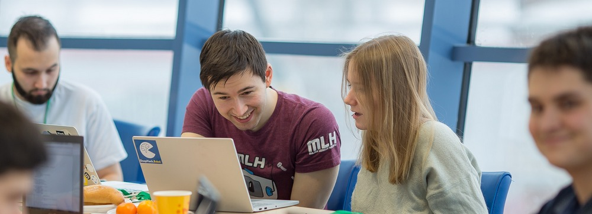
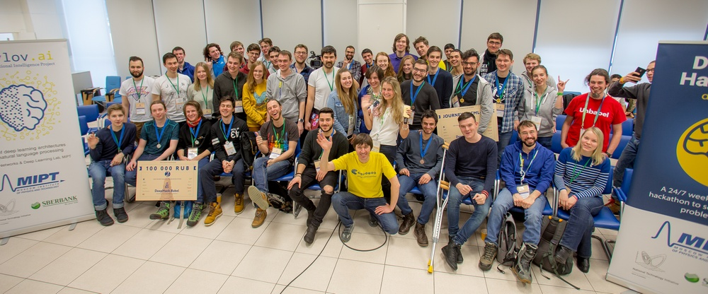

# 1st Conversational Intelligence Summer School (1st CISS)
July 2 to 8, 2018

Dolgoprudny, Russia

## Overview

Dialogue systems and conversational agents – including chatbots, personal assistants and voice control interfaces – are becoming increasingly widespread in our daily lives. In addition to the growing real-world applications, the ability to converse is closely related to the overall goal of AI. Recent advances in machine learning have sparked a renewed interest for dialogue systems in the research community. We are happy to announce the first international Conversational Intelligence Summer School (the 1st CISS), a very special camp designed to dive into the rapidly growing field of dialogue systems and conversational study AI.

Hosted by [Moscow Institute of Physics and Technology](https://mipt.ru/english/), summer school offers participants a chance to build solid understanding of core conversational AI concepts and techniques. Participants will  get hands-on experience in developing their own end-to-end dialog systems with the help of experts.

## Program

The program of the CISS school will combine lectures, tutorials and invited talks. Topics covered:
* Neural networks for natural language processing,
* Introduction to neural network frameworks,
* Best practices of dialogue systems development,
* Reinforcement learning for natural language processing,
* State of the art in dialogue systems.

## Fee and travel grants

Participation is free. Based on committee judging, a limited number of participant will be eligible for travel grants. We will provide сoffee breaks for all participants.

We particularly encourage young researchers and students to apply. This is your chance to make your dream a reality and learn concrete skills that could have a considerable impact on the technology industry at large.

